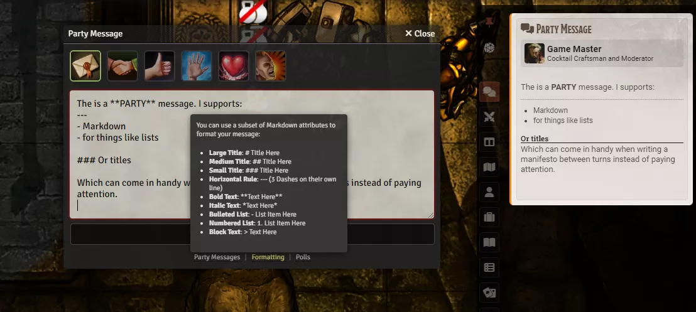
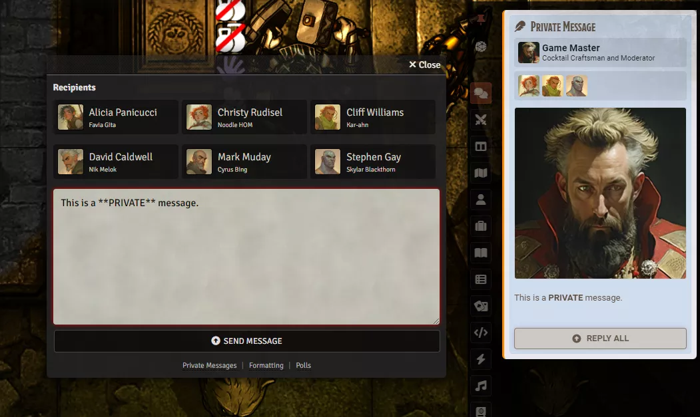
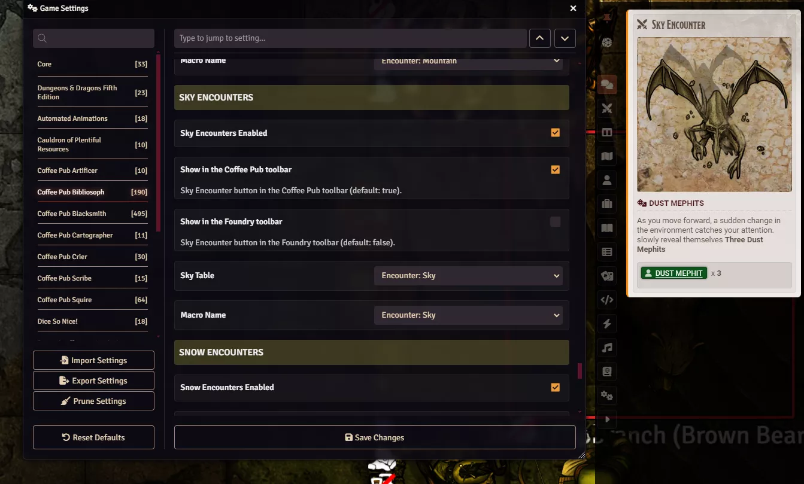
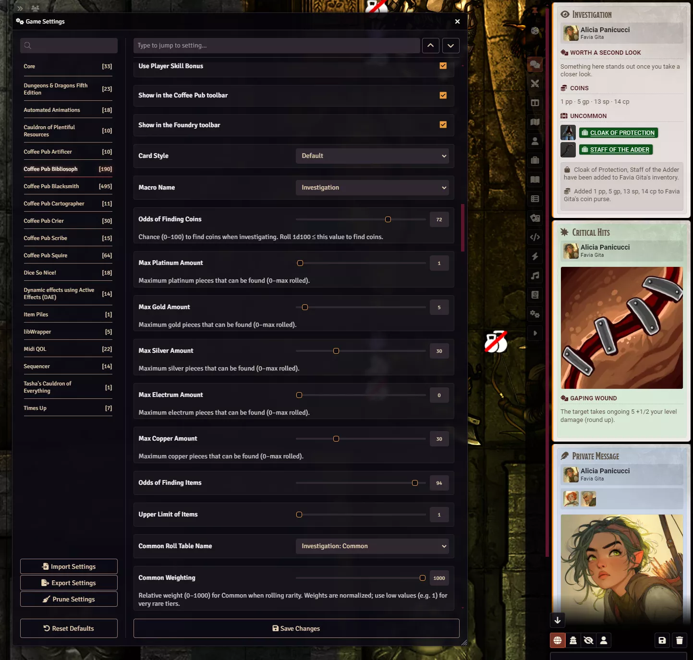

# Coffee Pub Bibliosoph


A comprehensive chat and encounter management module for Foundry VTT, designed to enhance your game's narrative and mechanical elements through specialized chat cards and automated features.

## Features

### Dynamic Chat System

- Public and private messaging with recipient selection
- Customizable chat cards for various game events
- Reply functionality built into chat messages

**Party Message**



**Private Message**



### Encounter Management

Specialized encounter generators for different environments: General, Cave, Desert, Dungeon, Forest, Mountain, Sky, Snow, Urban, and Water. Each type is configurable via macros and roll tables.



### Investigation System

When enabled, Investigation runs a full search flow with narrative, optional coins, and items by rarity.

- **Narrative:** Titles and descriptions come from `resources/investigation-narrative.json`. You can add many entries to `foundNothing` and `foundSomething`; one is chosen at random each time.
- **Coins:** Optional separate roll (Odds of Finding Coins). If successful, amounts are rolled from 0 up to each configured max (Platinum, Gold, Silver, Electrum, Copper) and added to the character's purse (D&D 5e currency).
- **Items:** One 1d100 roll (or 1d100 + INT + Proficiency when "Use Player Skill Bonus" is on for dnd5e) vs Odds of Success. If successful, a number of slots (1dN, N = Upper Limit of Items) are rolled. For each slot, rarity is chosen by weighted bands (Common through Legendary) using 0–1000 weightings, then one item is rolled on that rarity's table and added to inventory.
- **Card:** Shows narrative title and description, coins found (if any), items grouped by rarity with icons, and a summary of what was added to the character.



### Other Character Interactions

- Gift and Shady Goods (single table roll, single item to inventory)
- Beverage system
- Character biography integration
- Insult and praise mechanics

### Game Event Handlers

- Critical hit and fumble card generation
- Inspiration tracking
- Deck of Many Things integration
- Injury system with active effect application
- Status effect management

## Installation

Install via the manifest URL in Foundry VTT:

```
https://github.com/Drowbe/coffee-pub-bibliosoph/releases/latest/download/module.json
```

### Requirements and Recommendations

**Required**

- [Coffee Pub Blacksmith](https://github.com/Drowbe/coffee-pub-blacksmith) — Core module providing shared functionality for all Coffee Pub modules

**Recommended**

- [Coffee Pub Crier](https://github.com/Drowbe/coffee-pub-crier) — Combat turn announcements and notifications
- [Coffee Pub Scribe](https://github.com/Drowbe/coffee-pub-scribe) — Advanced text formatting and storytelling tools

### System Requirements

- Foundry VTT v13 or newer
- D&D 5e 5.5+ for full feature set (e.g. investigation coins and player skill bonus use dnd5e data)

## Module Integration

Coffee Pub Bibliosoph is part of the Coffee Pub suite:

- **Blacksmith** (required): Core functionality and shared resources
- **Bibliosoph**: Chat and encounter management
- **Crier**: Combat announcements and notifications
- **Scribe**: Text formatting and storytelling tools

Each module can run on its own except for the Blacksmith requirement; together they provide a fuller experience.

## Usage Guide

### Initial Setup

1. Install and enable Coffee Pub Blacksmith and Coffee Pub Bibliosoph.
2. Configure module settings for the encounter types and features you want.
3. Set up the corresponding macros for each enabled feature.

### Key Settings

- Features (encounters, investigation, messages, etc.) can be enabled or disabled individually.
- Macro names are set in module settings; the same macro can be used from the toolbar or the hotbar.
- Investigation: configure Odds of Success, Upper Limit of Items, coin odds and max amounts, and per-rarity roll tables and weightings (0–1000 scale). Optionally enable "Use Player Skill Bonus" so the find-items roll becomes 1d100 + Intelligence modifier + Proficiency (dnd5e).
- Active effects for injuries can be configured with custom durations and effects.

## License

This module is licensed under the [MIT License](LICENSE).

## Contributing

Issues and enhancement requests are welcome.
