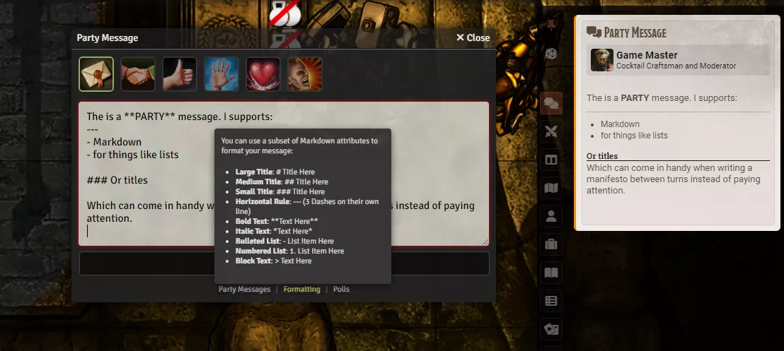
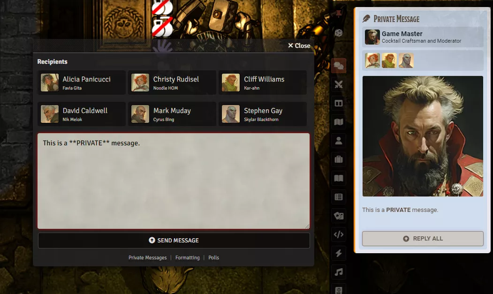
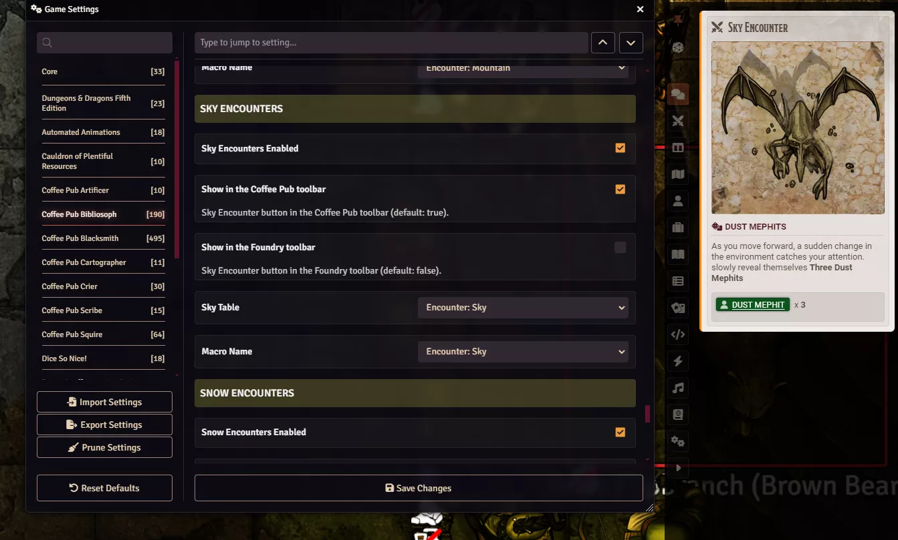
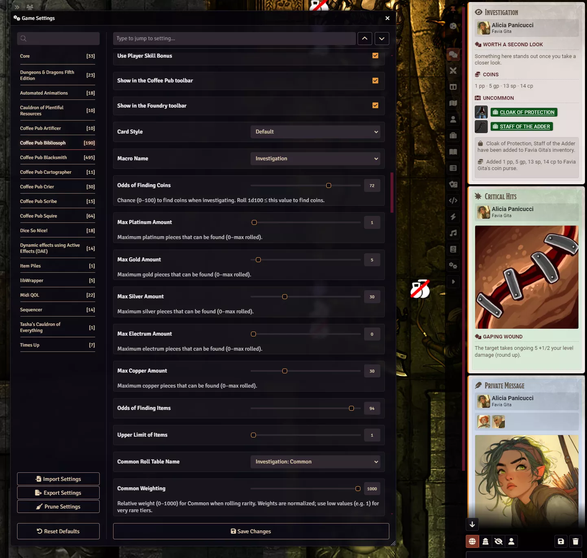

# Coffee Pub Bibliosoph


A comprehensive chat and encounter management module for Foundry VTT, designed to enhance your game's narrative and mechanical elements through specialized chat cards and automated features.

## Features

### Messages

- Unified Messages window with party, group, and 1:1 conversations (journal-backed — survives chat log wipes)
- @Mentions by user or character name, with partial matching and highlighted names; mentioned players get a pulsing alert and toast
- Clickable menubar notifications (via Blacksmith 13.9.3+): click to jump to the conversation, with a persistent unread counter
- Markdown formatting, image paste/drop, document links, reactions, typing indicators, and a collapsible conversation tray

**Party Message**



**Private Message**



### Encounter Management

Specialized encounter generators for different environments: General, Cave, Desert, Dungeon, Forest, Mountain, Sky, Snow, Urban, and Water. Each type is configurable via macros and roll tables.



### Investigation System

When enabled, Investigation runs a full search flow with narrative, optional coins, and items by rarity.

- **Narrative:** Titles and descriptions come from `resources/investigation-narrative.json`. You can add many entries to `foundNothing` and `foundSomething`; one is chosen at random each time.
- **Coins:** Optional separate roll (Odds of Finding Coins). If successful, amounts are rolled from 0 up to each configured max (Platinum, Gold, Silver, Electrum, Copper) and added to the character's purse (D&D 5e currency).
- **Items:** One 1d100 roll (or 1d100 + INT + Proficiency when "Use Player Skill Bonus" is on for dnd5e) vs Odds of Success. If successful, a number of slots (1dN, N = Upper Limit of Items) are rolled. For each slot, rarity is chosen by weighted bands (Common through Legendary) using 0–1000 weightings, then one item is rolled on that rarity's table and added to inventory.
- **Card:** Shows narrative title and description, coins found (if any), items grouped by rarity with icons, and a summary of what was added to the character.



### Other Character Interactions

- Beverage system
- Character biography integration
- Insult and praise mechanics

### Game Event Handlers

- Critical hit and fumble card generation
- Inspiration tracking
- Injury system with active effect application
- Status effect management

## Installation

Install via the manifest URL in Foundry VTT:

```
https://github.com/Drowbe/coffee-pub-bibliosoph/releases/latest/download/module.json
```

### Requirements and Recommendations

**Required**

- [Coffee Pub Blacksmith](https://github.com/Drowbe/coffee-pub-blacksmith) — Core module providing shared functionality for all Coffee Pub modules

**Recommended**

- [Coffee Pub Crier](https://github.com/Drowbe/coffee-pub-crier) — Combat turn announcements and notifications
- [Coffee Pub Scribe](https://github.com/Drowbe/coffee-pub-scribe) — Advanced text formatting and storytelling tools

### System Requirements

- Foundry VTT v13 or newer
- D&D 5e 5.5+ for full feature set (e.g. investigation coins and player skill bonus use dnd5e data)

## Module Integration

Coffee Pub Bibliosoph is part of the Coffee Pub suite:

- **Blacksmith** (required): Core functionality and shared resources
- **Bibliosoph**: Chat and encounter management
- **Crier**: Combat announcements and notifications
- **Scribe**: Text formatting and storytelling tools

Each module can run on its own except for the Blacksmith requirement; together they provide a fuller experience.

## Usage Guide

### Initial Setup

1. Install and enable Coffee Pub Blacksmith and Coffee Pub Bibliosoph.
2. Configure module settings for the encounter types and features you want.
3. Set up the corresponding macros for each enabled feature.

### Key Settings

- Features (encounters, investigation, messages, etc.) can be enabled or disabled individually.
- Macro names are set in module settings; the same macro can be used from the toolbar or the hotbar.
- Investigation: configure Odds of Success, Upper Limit of Items, coin odds and max amounts, and per-rarity roll tables and weightings (0–1000 scale). Optionally enable "Use Player Skill Bonus" so the find-items roll becomes 1d100 + Intelligence modifier + Proficiency (dnd5e).
- Active effects for injuries can be configured with custom durations and effects.

### Toast Channels (streaming and camera accounts)

Blacksmith's **Toast Excluded Users** setting stops a user's client from rendering toasts at all — the right behaviour for a camera or stream account that cannot click a toast closed. But some announcements are exactly what a broadcast exists to capture, so Bibliosoph labels each broadcast toast with a **channel**. Listing a channel in Blacksmith's **Channels Excluded Users Still See** lets it through to excluded users; everything else stays suppressed.

Bibliosoph sends four channel names:

| Channel | Toasts |
|---|---|
| `crit` | Critical hit announcements |
| `fumble` | Fumble announcements |
| `injury` | Injury-threshold announcements |
| `social` | Beverage Break, Bio Break, Insult, Praise |

They are separate so the allowance can be partial — `crit,fumble` puts the dice moments on camera while injuries and table gags stay off it. Toasts not listed here (local confirmations, warnings) carry no channel and are always suppressed for excluded users.

Two things to know:

- **Names must match exactly** (case and spelling; whitespace is trimmed). A mismatch fails silently — the toast just doesn't appear. Two ways to check: switch on Blacksmith's Debug Mode and play for a minute, and it names each channel as it first sees one, giving you the live list of what is actually being sent; or run the test harness in [testing/test-harness-macro.js](testing/test-harness-macro.js), whose **Audit toast channels** scenario under Tools reports who is excluded and which of our four channels reach them, and whose **Fire one toast per channel** scenario broadcasts one of each so you can watch a real excluded client.
- **Channel names are global, not namespaced.** If another module also sends `crit`, allowing it allows both.

Requires a Blacksmith build newer than 13.15.0. On older builds the channel is ignored and excluded users see nothing, exactly as before.

## License

This module is licensed under the [MIT License](LICENSE).

## Contributing

Issues and enhancement requests are welcome.
