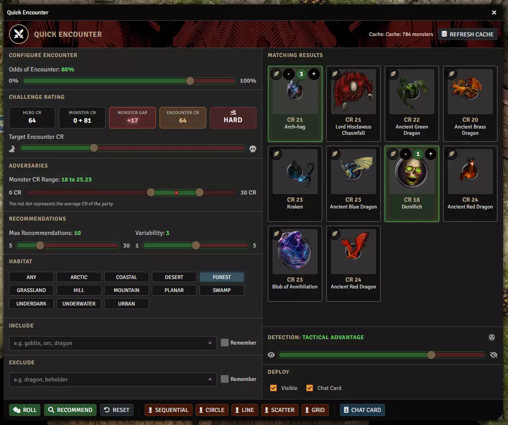
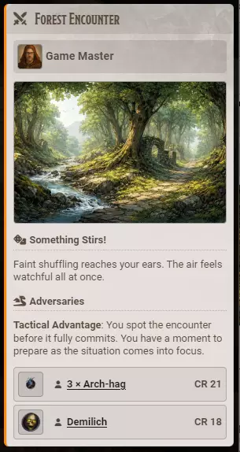
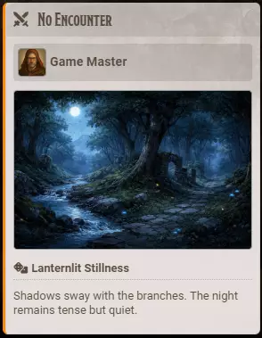
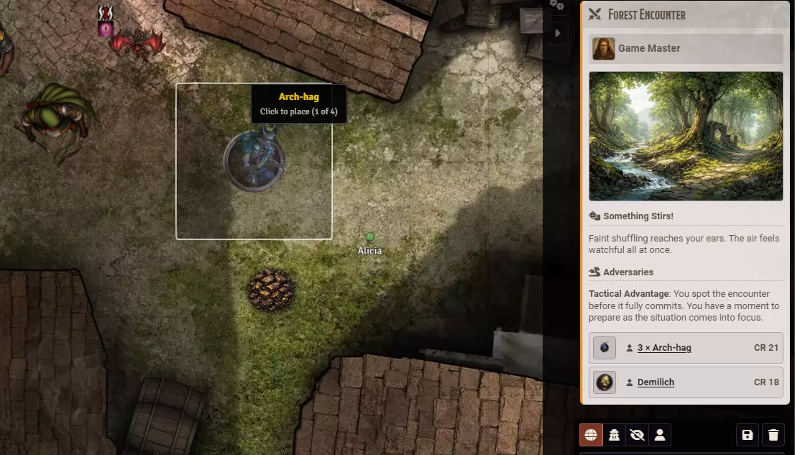

# Building an Encounter

**Audience:** a GM building a fight at the table with Quick Encounter.

How to get a monster list matched to your party, roll for who noticed whom, and put the result on the map.

Quick Encounter is for building a fight in the moment rather than in prep. Tell it where the party is and how hard you want it, and it proposes monsters from the compendiums you already have installed.

This is GM-only.

## The window

Click **Quick Encounter** on the toolbar. Configuration is down the left, the monsters it proposes are on the right, and the buttons that do something are along the bottom.

## Build the cache first

Top right is the cache, showing how many monsters it currently knows about, and **Refresh Cache** beside it.

Click it once before your first encounter. It reads your installed monster compendiums and remembers what is in them, because scanning them every time you opened the window would be too slow to be worth using. Refresh it again after you install or remove a monster compendium; otherwise leave it alone.

## Set the difficulty

**Challenge Rating** shows you where you stand, and updates as you change the encounter:

| Reading | What it means |
|---|---|
| **Hero CR** | What the party is worth |
| **Monster CR** | What you have picked so far |
| **Monster Gap** | The distance between the two |
| **Encounter CR** | What the encounter comes to |
| The badge beside them | The verdict in words, from trivial through to deadly |

**Target Encounter CR** is the difficulty you are aiming at. **Monster CR Range** bounds how weak or strong an individual monster may be, on a slider from 0 to 30 CR; the red dot on it marks the average CR of your party, so you can see where your bracket sits relative to them.

## Choose where you are

**Habitat** filters candidates to monsters tagged for that environment: Any, Arctic, Coastal, Desert, Forest, Grassland, Hill, Mountain, Planar, Swamp, Underdark, Underwater, or Urban.

**Include** and **Exclude** take monster names -- "goblin, orc, dragon" -- to force particular monsters in or keep them out. Tick **Remember** beside either to keep that list between sessions.

**Max Recommendations** caps how many options you are offered, and **Variability** decides how far the builder may stray from a tidy answer.

## Get a monster list

**Recommend** fills the panel on the right with candidates. **Roll** decides whether an encounter happens at all, using **Odds of Encounter**, and builds one if it does. **Reset** clears what you have set up.

Each result shows its CR and name. Click one to add it to the encounter: it gains a highlight and a counter with plus and minus, so a single result can be three of that monster. Click again to remove it.

If the builder runs out of distinct monster types that fit your bracket, it adds more of the ones it already picked rather than quietly widening the CR range on you.

## Roll for who noticed whom

**Detection** decides how the encounter opens, on a five-step slider running from the party being seen to the party being unseen:

| Level | What it means |
|---|---|
| Surprised | The party walked into it |
| Outmatched Awareness | The monsters have the better of it |
| Mutual Awareness | Everyone sees everyone |
| Tactical Advantage | The party has the better of it |
| Undetected | The party has not been noticed |

Set it by hand with the slider, or use the dice control beside it to ask the party for Perception and let their average decide which rung you land on.

## Post the card

**Chat Card** posts the encounter to chat: artwork for the habitat, a piece of narration chosen for the habitat **and the time of day**, the detection level written out as prose the players can read, and the monsters with their counts and CRs.

A roll that comes up with no encounter posts a card too, so the moment still lands at the table rather than nothing happening.

Under **Deploy**, **Visible** decides whether the tokens arrive visible or hidden, and **Chat Card** whether posting happens automatically.

## Put it on the map

The five buttons along the bottom -- **Sequential**, **Circle**, **Line**, **Scatter** and **Grid** -- place the whole encounter in that arrangement. Each monster is placed in turn, and the cursor tells you which one you are placing and how many are left.

**Or drag one monster** from the posted card straight onto the map. A drag places exactly one monster where you point, and deliberately ignores the count. Foundry handles the drop itself, so permissions, importing from the compendium and grid snapping all behave the way they do from the Actors sidebar.

## Settings worth knowing

- **Quick Encounter enabled** shows or hides the tool. Turning it off removes the toolbar button.
- **Toolbar** chooses which toolbar carries the button. To remove the button entirely, switch the feature off rather than hiding it from both.
- **Odds of Encounter** is also on the window itself, so you can change it for one roll without opening settings.
- **Encounter Sound** and **No Encounter Sound** play for each outcome of a roll.
- **Chat Card Style** sets the card's theme.

## A note on the cards

Quick Encounter cards still render through Bibliosoph's older card path, so they do not match the styling of injury or critical cards in every detail. They are correct and legible; only the presentation differs. Known issues records it.
