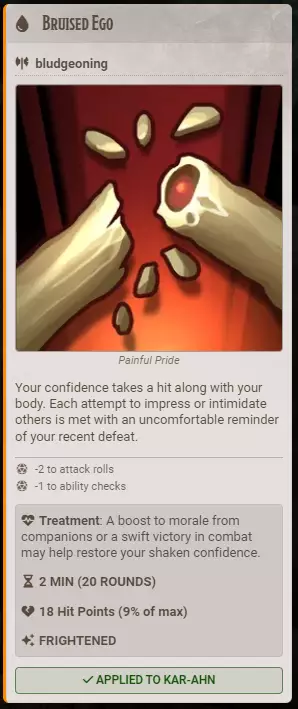
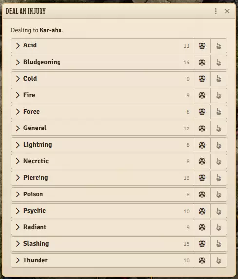
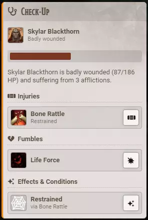

# Injuries at the Table

**Audience:** a GM running injuries, and a player whose character has one.

What an injury does to a character, how one is dealt, what the recipient sees, and how to get rid of it. Writing your own injuries is a separate job -- see [writing your own injuries](userguide-authoring-injuries.md).

An injury is what remains after a hit lands hard. It takes hit points once, may apply a condition, may impose real penalties on rolls, and may bleed a little each turn until somebody treats it.

## What an injury does to your character

When one lands you get a card in chat naming the wound, its artwork, what it does, and how it might be treated. Applying it puts a real effect on the token, and a burst plays on the canvas so the whole table sees it happen.

The card states its mechanics plainly, so nobody has to interpret prose:

- **Damage, once.** Shown both ways -- as hit points and as the percentage of maximum hit points it came from -- because the percentage is what was authored and the hit points are what you lost. The same wound therefore hurts a level 1 character and a level 15 one comparably.
- **A condition, sometimes.** Blinded, prone, frightened and so on -- a real condition, applied the way Foundry applies any other, so it shows on the token and in every module that reads conditions.
- **Penalties, sometimes.** A minus to attacks, damage, AC, checks or saves, applied as a genuine effect rather than a note somebody has to remember.
- **A duration**, given in minutes and in rounds.
- **A bleed, rarely.** A small amount of damage at the start of your turn, for wounds that are an ongoing physical process.

**An injury will never drop you below 1 hit point.** Not the initial damage, not the bleed. Injuries maim; dying is what death saves are for.

Once it has been applied the card says so and names who carries it, so it cannot be applied twice.

Most injuries heal on their own when their duration runs out. Some are written to stop bleeding but stay until somebody tends them, and some are permanent until treated.

## Deal an injury by hand

GM only. Target or select a token and click **Injuries** on the toolbar. The picker opens, naming who you are dealing to.

Each row is a damage type, with the number of injuries written for it and two controls:

| Control | What it does |
|---|---|
| The die | Rolls a random injury of that type, weighted so the nasty ones are rare |
| The hand | Asks the target's own player to roll it themselves |
| The arrow at the left | Expands the type, listing its injuries so you can deal one exactly, or open its page to read it |

The wound lands on the token you have targeted, falling back to the one you have selected. You must own the target's actor, and a token never gets the same injury twice.

The hand is worth knowing about: it sends the injured player a prompt they click to roll their own wound, which is the same prompt automation sends. Some tables prefer the player to be the one who turns the card over.

## Let injuries happen on their own

GM only, and off by default. Set **Automation** for injuries and a character who takes a single hit worth at least **Injury Threshold (% of Max HP)** of their maximum hit points gets an injury matching the damage type that caused it.

The Automation setting is a ladder:

- **Off** -- no detection, and the toolbar button is hidden.
- **Manual** -- the toolbar button only. No detection, no prompts.
- **Automated Detection** -- a hit crosses the threshold, and the owner gets a prompt with a button to roll the injury.
- **Fully Automated** -- the injury is rolled and posted the moment the hit lands.

**Triggered By** limits this to players, to monsters, or to everyone, judged by who was injured. **Automatically Apply Injury** goes one step further and puts the wound straight onto the character, so the card arrives already applied instead of carrying a button.

Healing never triggers an injury, and the damage an injury deals cannot trigger another one.

This needs a recent Blacksmith. On an older build nothing fires and nothing complains; the picker still works.

## Treat an injury

GM only to start. Target or select a character and click **Check-Up**.

You get the patient's portrait, how badly hurt they are, their hit points, and a sentence summing it up, then everything currently afflicting them grouped into zones -- Injuries, Criticals, Fumbles, and Effects and Conditions for everything Bibliosoph did not stamp: plain conditions, other modules' effects, anything stale. An empty zone is left out.

Each row carries a treat control at its end, and hovering shows the full text. A condition that arrived with an injury says so on its own row, so you can tell what put it there.

**Who can press treat:** the GM, always, on anyone. A player, on a character they own.

With **Player Treatment Rolls** on, treating becomes a Medicine check against the injury's difficulty, which comes from its severity -- 10 for a minor wound, 15 for a moderate one, 20 for a major one.

| Situation | What changes |
|---|---|
| The healer has a healer's kit | Advantage, and the difficulty drops by 2 |
| You are treating yourself | Disadvantage |
| Both | A normal roll, and the difficulty still drops by 2 |
| Natural 20 | It heals regardless of the difficulty, and restores 5 hit points |
| Natural 1 | It fails, and costs the patient 5 hit points |

The natural 20 and natural 1 rules are the **Treatment Crits and Fumbles** setting, and can be switched off.

**One attempt per character per injury.** **Retry Treatment After** decides when that resets -- after a long rest, after any rest, or never. **DC Rise Per Failed Attempt** can make an injury harder each time somebody fails on it; set to zero, retries are free.

**Consume Kit Uses** decides whether an attempt spends a use of the kit. **Healer's Kit Item Names** is where you add your own kits, or a translated name, so they count.

Treating a wound ends the affliction and lifts the condition it applied. **It does not give back the hit points the injury cost.** Treatment stops the ongoing problem; healing is a separate job.

## Getting rid of one any other way

The condition an injury applied is cleaned up **however the injury leaves** -- treated from the card, deleted from the character sheet, removed from the token, or simply expiring. You do not have to use the Check-Up card for the character to end up in a clean state.

If two injuries both made you prone, curing one leaves you prone, because the other one still says so. That is deliberate.

## If something looks stuck

A lingering wound shows what it does per turn but no countdown while it is bleeding. That is a known gap in the display, not a stuck effect -- the phase does end on time. Known issues lists it.
