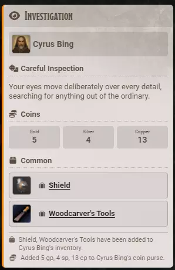

# Searching a Room

**Audience:** a player searching somewhere, and the GM setting up what can be found.

What the Investigation button does, what reaches your character sheet, and how a GM stocks it with their own loot.

## Search

Click **Investigation** on the toolbar. Any player can.

Your character searches, and a card is posted saying what turned up: a piece of narration, any coins, and any items. **Anything found is added to your character sheet automatically** -- items into your inventory, coins into your purse.

The card names the character who searched, then the narration. Coins appear as one tile per denomination, and only the denominations actually found are shown. Items are listed under a heading for their rarity, each one a link you can click to open it.

The last two lines are the receipt: which items went into the inventory, and how much money went into the purse.

Two separate rolls happen, one for coins and one for items, so a search can turn up money and nothing else, or items and no money, or neither.

If a card lists an item but says nothing about adding it, that item could not be written to your sheet and the GM is told to add it by hand. The card lists what the search found; the line about your inventory only claims what actually landed.

## Whose character searches

The character you are playing. If you have no character assigned, the token you have selected. With neither, the card is posted under your own name and nothing is added to a sheet.

## Improve your odds

If the GM turns on **Use Player Skill Bonus**, the roll to find items adds your character's Intelligence modifier and proficiency bonus. A trained investigator genuinely finds more than an unobservant one.

Without it, everybody has the same chance.

## Stocking it, for GMs

Investigation finds items from **roll tables you supply**. Bibliosoph ships none -- the loot at your table is yours.

Make a roll table per rarity and name it in the matching setting: **Common Roll Table Name**, **Uncommon**, **Rare**, **Very Rare** and **Legendary**. The table's results need to be linked items, so that what is rolled is a real thing that can go into an inventory.

**A rarity with no table set simply never comes up.** That is the way to switch a tier off.

### How often each rarity appears

Each rarity has a **Weighting** from 0 to 1000. These are relative weights, not percentages, and they are normalised, so you do not have to make them add up to anything. Use a low value like 1 for the tiers you want to be genuinely rare.

### How much is found

- **Odds of Finding Items** is the chance a search finds anything at all.
- **Upper Limit of Items** is the *most* a single search can yield. The actual number is rolled up to that limit, so a setting of 3 means one, two or three chances -- not always three.

Each chance resolves independently: a rarity is picked by the weightings, then that rarity's table is rolled once. A chance that lands on a rarity with no table, or rolls something that is not a real item, quietly finds nothing. A search that turns up two things out of three chances is an ordinary result, not an error.

### Coins

**Odds of Finding Coins** gates the separate coin roll. On a success, each denomination rolls between zero and its **Max Amount** -- platinum, gold, silver, electrum and copper. Set a denomination's maximum to zero and it never appears. If every denomination happens to roll zero, no coins were found.

### Narration

The prose comes from a narrative file shipped with the module, holding a set of entries for finding nothing and a set for finding something. One is picked at random. Editing that file reskins every search at your table at once, and keeps the narration from drifting away from the mechanics that produced it.

### Other settings

- **Investigations Enabled** switches the feature off, which also removes its toolbar button.
- **Toolbar** chooses which toolbar carries the button. To remove it, switch the feature off rather than hiding it from both.
- **Chat Card Style** sets the card's theme.

## A note on the cards

Investigation cards still render through Bibliosoph's older card path, so their styling does not match injury or critical cards in every detail.
