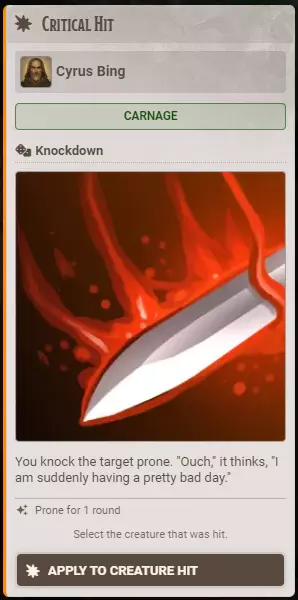
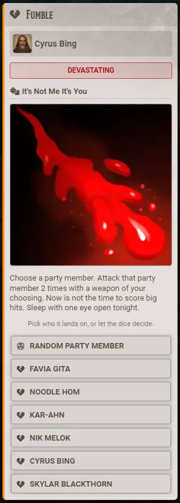

# Criticals and Fumbles

**Audience:** a GM running critical hits and fumbles, and a player who just rolled one.

What happens on a natural 20 or a natural 1, who gets to apply the result, and how to point the module at your own cards.

Bibliosoph draws criticals and fumbles from decks of authored cards rather than roll tables. That is the whole difference: a table row can only describe "the target is blinded for a round", where a card carries the blinding, the round, and the damage as real values the Apply button puts on the token.

Ninety-four ship -- 47 criticals and 47 fumbles.

## Roll one

Click **Critical Hit** or **Fumble** on the toolbar. A card is drawn from the deck, weighted so the nastier results are rarer, and posted to chat.

With **Automation** set to detect them, you do not have to click anything: a natural 20 or natural 1 at the table produces the card on its own. The ladder is the same one injuries use -- Off, Manual, Automated Detection (you get a prompt with a button to roll), or Fully Automated (the card posts immediately). **Triggered By** limits detection to players, to monsters, or to everyone.

## Read the card

The card names who rolled it, the severity bucket it came from, and the result. Under the artwork and the prose is a mechanics line saying exactly what the card does, in plain terms -- something like "Prone for 1 round", or "8 damage, Stunned for 1 round, -2 to attack rolls for 2 rounds".

Above the buttons is a line telling you what to do next: whether to select a creature first, or pick who it lands on.

Below that are the apply controls, and what they look like depends on who the card is meant for:

| The card applies to | What you get |
|---|---|
| The creature that was hit | One button, naming them when the module knows who they were |
| The roller | One button, naming them |
| An ally | One button per party member, plus **Random Party Member** |
| The whole party | A single button that applies to everyone, with nothing to choose |
| Anyone nearby | One button, and the GM selects who is in range |

A button that names somebody is bound to that character. A card records a moment, so it will not quietly re-aim at whoever happens to be selected later.

## Apply it

**A player can apply a card their own roll produced.** The GM can apply anything. Nobody else sees the controls at all.

The exception is a button that asks you to select a creature on the canvas -- those stay GM-only, because they act on whatever the person clicking has selected, and a player clicking one would land it on the wrong token.

Once a card is applied it says so and cannot be applied again. That stamp is stored on the message, so it survives a reload and looks the same to everyone.

Applying plays a burst on the canvas -- gold and triumphant for a critical, a jagged mess of debris for a fumble -- on every connected client.

**If no GM is connected,** a player's click is refused and they are told so. The GM's client is what actually performs the change.

## Cards that ask for more than one person

Some cards say something like "two party members each lose 1 hit point". Those keep the picker open until you have chosen as many as the card asks for. The instruction counts down, a running line names who you have picked, and the closing stamp lists everyone.

Somebody already chosen has their button retired, so you cannot pick the same person twice, and **Random Party Member** never lands on somebody already picked.

## Cards that deal an inspiration card

A few criticals hand somebody an inspiration card instead of applying an effect. Whoever the card was aimed at is who gets it. See [inspiration](userguide-inspiration.md).

## Use your own criticals and fumbles

**Criticals Source** and **Fumbles Source** name the compendiums the cards are drawn from. They default to the ones Bibliosoph ships; point them at your own to use your own.

**These are the only source.** Set one to None and no cards of that kind are posted at all -- there is no roll-table fallback, because a table row cannot carry the mechanics these cards are built around, and silently posting a look-alike with none of them was worse than saying so.

Inside a compendium, the journals are just browsing buckets, named for severity: Butchery, Carnage and Slaughter for criticals; Meek, Nasty and Devastating for fumbles. **Renaming a journal, adding your own, or dragging pages between them changes nothing** about how cards are drawn -- every page states its own severity and its own odds. Add a Homebrew journal if you like.

## Presentation

**Show Outcome Images (Criticals and Fumbles)** turns the artwork on and off. It is one switch covering both, so turning it off for fumbles turns it off for criticals too.

**Chat Card Style** sets the card's theme, separately for each kind. The **Toast Design** settings control the announcement that fires when a natural 20 or 1 is detected -- its wording, size, sound, colours and animation. The title and message accept codes: `{name}` who rolled, `{target}` who they hit, `{weapon}` what they used, `{d20}` the die face, and `{total}` the attack total.

GM notes shipped with a card show as a tooltip for GMs only, and are never written into the card where a player could read them.
